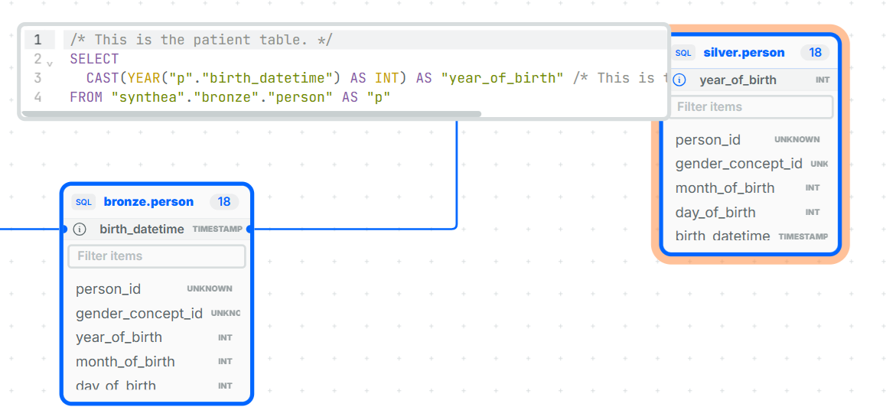
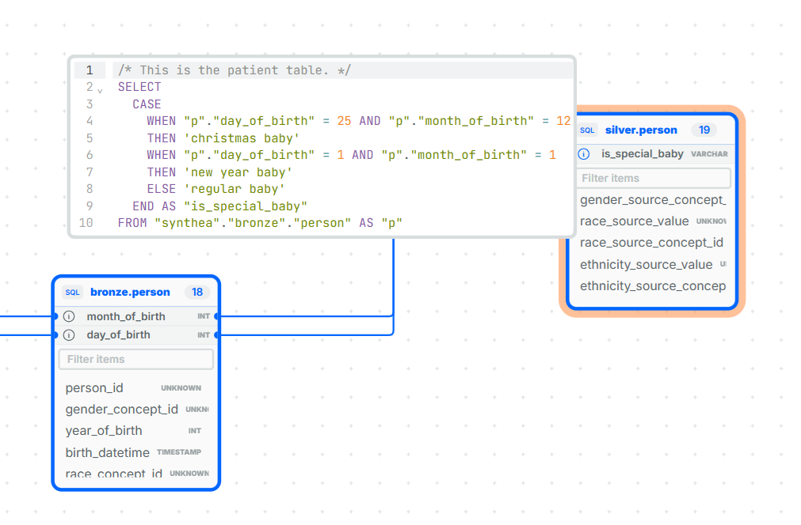

# STROMA - Scalable Transpiling Reproducible OMOP Medallion Architecture

__Data Science Team, Lancashire Teaching Hospitals NHS Foundation Trust__

## Introduction

This repository has the transformations, tests and snapshots for generating silver and gold layers of the medallion architecture from a bronze OMOP layer.

The source layer must be OMOP v5.4 conformant including all the clinical and vocabulary tables as a minimum.

## Development

STROMA uses [SQLMesh](https://sqlmesh.readthedocs.io/en/stable/) to manage the entire data transformation lifecycle.

## Key Features of SQLMesh

Read more about the core features of SQLMesh [here](https://sqlmesh.readthedocs.io/en/stable/#core-features).

### Collaboration

SQLMesh makes it easier to engineer and maintain data pipelines collaboratively, with multiple developers contributing to the same project, building models (tables or views) within the same data warehouse/lakehouse without breaking each other's work through the use of [virtual data environments](https://sqlmesh.readthedocs.io/en/stable/concepts/environments/).

### Efficiency

SQLMesh also improves computational efficiency through

- avoiding unnecessary model builds using its [_built-in scheduler_](https://sqlmesh.readthedocs.io/en/stable/guides/signals/),
- improved data quality through [_tests_](https://sqlmesh.readthedocs.io/en/stable/concepts/tests/) and [_audits_](https://sqlmesh.readthedocs.io/en/stable/concepts/audits) and
- multiple [_incremental update strategies_](https://sqlmesh.readthedocs.io/en/stable/concepts/models/model_kinds/).

This reduces the overall cost of developing and running data pipelines, especially for cloud-based workloads that are billed by usage.

This approach also makes it easier to use version control and [CI/CD](https://en.wikipedia.org/wiki/CI/CD)-based workflows where code commits automatically trigger GitHub actions that can perform a range of tasks using SQLMesh's [CI/CD Bot](https://sqlmesh.readthedocs.io/en/stable/integrations/github/).

### Model Changes, Lineage, and Transpilation

SQLMesh (through the use of another Python library, [SQLGlot]()), is able to understand SQL and therefore any changes to a model query and how it may affect any other models that depend on it.
This also allows it to generate detailed column-level lineage which allows teams to better understand their data pipelines and work more effectively as a team.

SQLMesh can track the exact lines of code that result in new columns generated from upstream models.
For instance, in the image below, it is clear that the `year` column in the `silver.person` model has been calculated from the `birth_datetime` column of the upstream `bronze.person` model rather than the `year` column in that model.

It can also do this when a downstream column is created from a combination of two or more upstream columns as shown in the image below.

